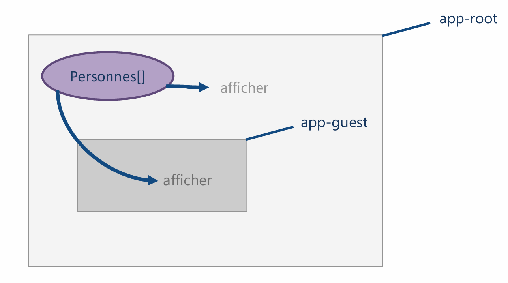
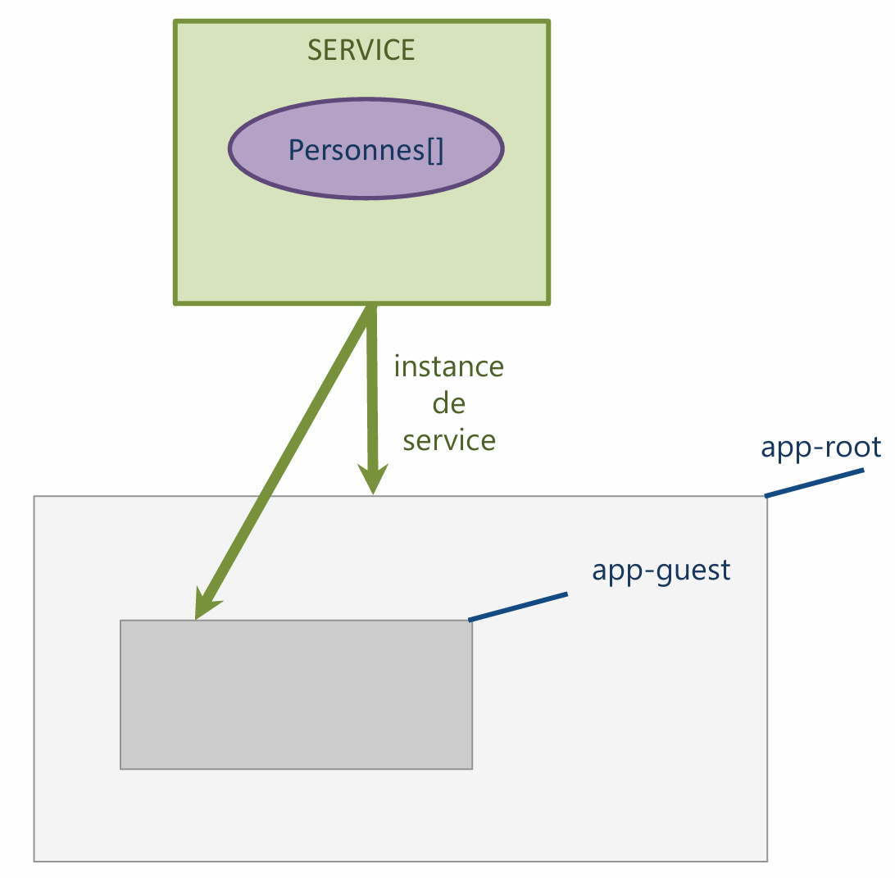
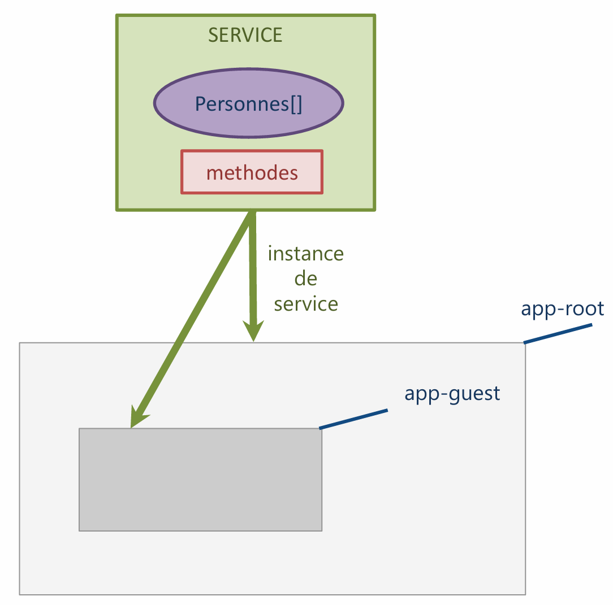

# Module 10 - Mise en place d'un Service
:one: Pourquoi mettre en place un service ?  
:two: Création d’un service  
:three: Appeler le service depuis le composant principal  
:four: Récupérer les données du service  
:five: Modifier les données du service    
:six: Appeler le service depuis un autre composant    
 

## :one: Pourquoi mettre en place un service ?

- Partager les données
- Centraliser les données
- Une seule source à jour de vérité  

--------------------------------

 $\color{red}{\text{SANS Le service}}$  

--------------------------------

 $\color{green}{\text{AVEC Le Service}}$
 - Le service contient désormais **le tableau** d'objets

--------------------------------
 
 Pour modifier les données :
- Chaque componsant appelle désormais **les méthodes** du service

--------------------------------

# :two: Création du Service
Création du répertoires <code>services</code> dans le répertoire <code>app</code>
- Création du fichier <code>personne.service.ts</code>
;;

