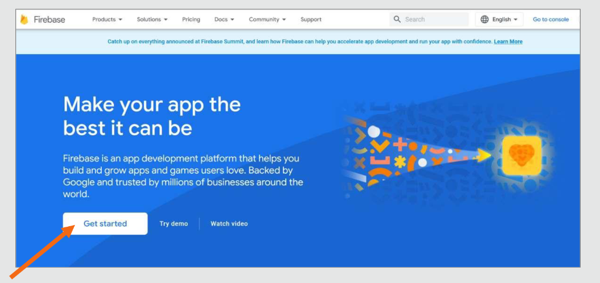
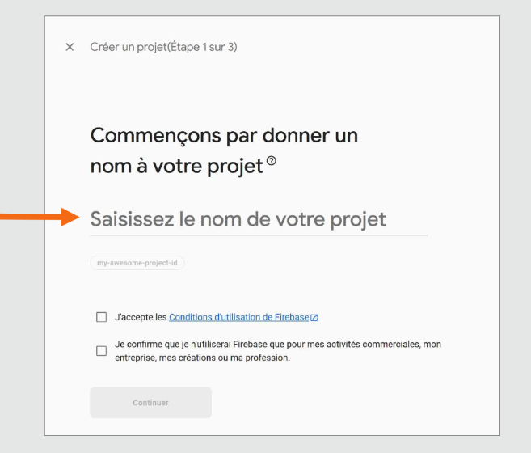
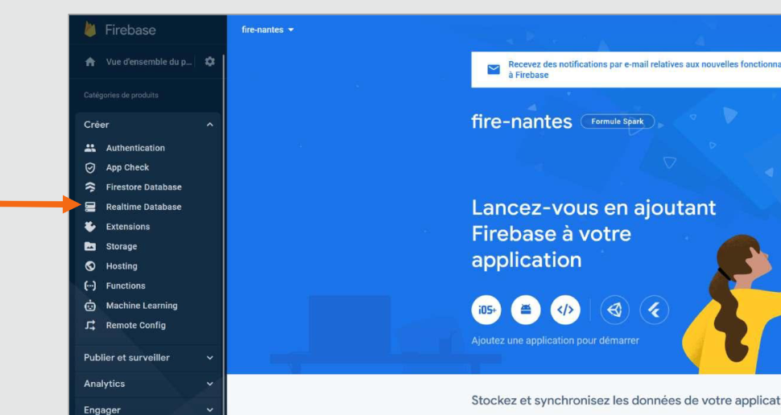
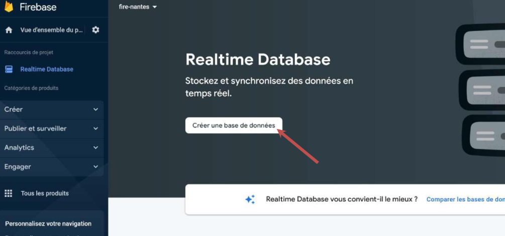
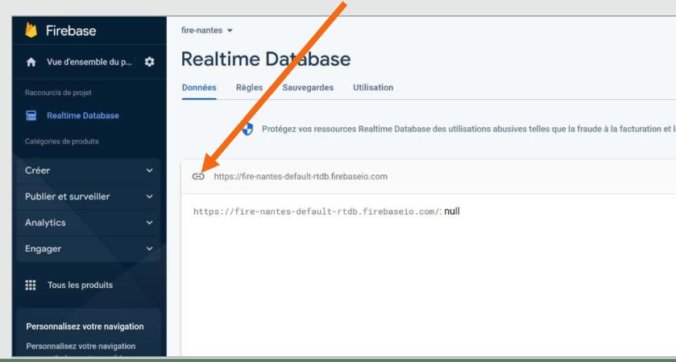

# Module 13 - Communiquer avec une  API

## Créer un API de type backend = NO Backend
Sur FireBase
Nous allons activer le service Real **Time Data Base**
<a href="">firebase</a>
  
    

  
:one: Créer un Projet

:two: Aller sur la section **Real Time data base**

:three: Créer une **Real Time data base**

  

:four: Activer **le mode test**

:five: Cliquer les les chaînes pour copier coller l'url de la data base

