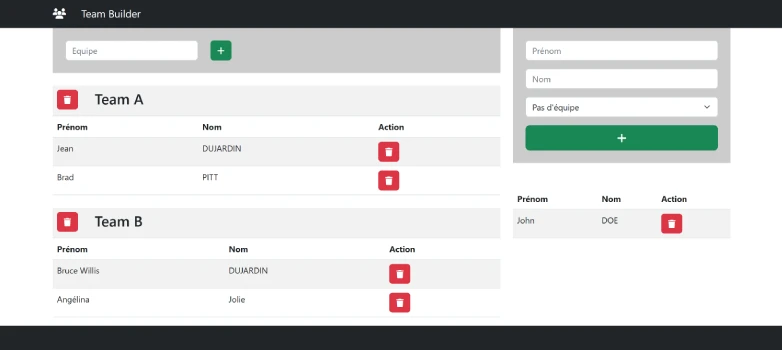

# TP Echo Team Builder  


**live preview** :  
[Tester le TP Echo](https://www.sevenvalley.fr/tp-javascript/tpe) 



- Créer un seul component : Equipe
**Le component equipe :**
```html
<table class="table table-striped mt-4">
  <tbody>
    <tr>
      <td colspan="3">
        <div class="row">
          <div class="col-1">
            <button class="btn btn-danger">
              <i class="fa fa-trash"></i>
            </button>
          </div>
          <div class="col-6">
            <h3>Team A</h3>
          </div>
          <div class="col-5"></div>
        </div>
      </td>
    </tr>

    <tr>
      <th>Prénom</th>
      <th>Nom</th>
      <th>Action</th>
    </tr>

    <tr>
      <td>Jean</td>
      <td>DUJARDIN</td>
      <td>
        <button class="btn btn-danger">
          <i class="fa fa-trash"></i>
        </button>
      </td>
    </tr>
    <tr>
      <td>Brad</td>
      <td>PITT</td>
      <td>
        <button class="btn btn-danger">
          <i class="fa fa-trash"></i>
        </button>
      </td>
    </tr>
  </tbody>
</table>
```
- Création d'objet Equipe
- Création d'objet Personne
- Création d'un objet Entreprise
- Ajouter des personnes dans des équipes

## Structure :
**Entreprise :**
```js
const entreprise ={
    personnes =[];
    equipes =[];
}
```

**Personne :**
```js
const personne ={
    id: '42',
    prenom: 'Brad',
    nom:'PITT'
}
```

**Equipe :**
```js
const equipe ={
    id: '23',
    nom: 'Team A'
    personne:[
        { id: '42',prenom: 'Brad', nom:'PITT'},
        { id: '22',prenom: 'Tom', nom:'CRUISE'},
    ]
}
```
## EXERCICES
**Excercice 1**  
Créer le tableau  **nouveauClients** à partir de personnes et clients  
utiliser <code>.filter</code> et <code>.find</code>
```js
    const personnes =[
        {id:1,nom:'BRAD',prenom:'PITT'},
        {id:2,nom:'TOM',prenom:'CRUISE'},
        {id:3,nom:'Angelina',prenom:'Jolie'},
        {id:4,nom:'Tom',prenom:'CRUISE'}
    ];
    const clients =[
        {id:1,nom:'BRAD',prenom:'PITT'},
        {id:3,nom:'Angelina',prenom:'Jolie',age:16}
    ];
// const nouveauClients =[
//         {id:2,nom:'TOM',prenom:'CRUISE'},
//         {id:4,nom:'Tom',prenom:'CRUISE'}
//     ];
```
**Excercice 2**  
Créer le tableau  **dejaClients** à partir de personnes et clients  
utiliser <code>.filter</code> et <code>.find</code>
```js
    const personnes =[
        {id:1,nom:'BRAD',prenom:'PITT'},
        {id:2,nom:'TOM',prenom:'CRUISE'},
        {id:3,nom:'Angelina',prenom:'Jolie'},
        {id:4,nom:'Tom',prenom:'CRUISE'}
    ];
    const clients =[
        {id:1,nom:'BRAD',prenom:'PITT'},
        {id:3,nom:'Angelina',prenom:'Jolie',age:16}
    ];
// const dejaClients =[
//     {id:1,nom:'BRAD',prenom:'PITT'},
//     {id:3,nom:'Angelina',prenom:'Jolie'},
//     ];
```

**Excercice 3**   
Créer le tableau  **majeurs** à partir de personnes  
utiliser <code>.fitler</code>
```js
        const personnes =[
        {id:1,nom:'BRAD',prenom:'PITT',age:18},
        {id:2,nom:'TOM',prenom:'CRUISE',age:15},
        {id:3,nom:'Angelina',prenom:'Jolie',age:16},
        {id:4,nom:'TOM',prenom:'CRUISE',age:61}
    ];
   
// const majeurs =[
//     {id:1,nom:'BRAD',prenom:'PITT',age:18},
//     {id:4,nom:'TOM',prenom:'CRUISE',age:61}
//     ];
```


**Excercice 4**  
Créer le tableau  **majeurs** à partir de personnes  
1 - Calucler le Total avec <code>.map</code>  
2 - calculer le Toatl avec <code>.reduce</code>
```js
const items = [
  { name: 'Apple', price: 1 },
  { name: 'Orange', price: 2 },
  { name: 'Mango', price: 3 },
];

let totalPrice = 0;

```